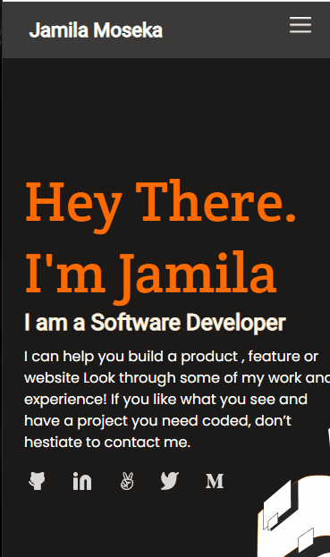

# Portfolio-Mobile1

> This project builds a personal porfolio site. It is meant to

> ✔ understand how to parse a Figma design to create a UI.

> ✔ Use flexbox to place elements in the page.

> ✔ Use images and backgrounds to enhance the look of the website.

## Built With

- Languages: HTML, CSS
- Technologies used: Html-Css Linters, Node Modules

## Demo

## Getting Started

To get a local copy up, fork the project and clone to your local repository.

## Authors

👤 - GitHub: [@jmoseka](https://github.com/jmoseka)

## 🤝 Contributing

Contributions, issues, and feature requests are welcome!

## Show your support

Give a ⭐️ if you like this project!

## 📝 License

This project is [MIT](./MIT.md) licensed.
